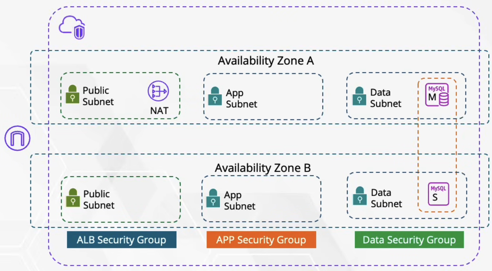

# AWS 3-Tier Architecture Infrastructure

This repository contains the Terraform configuration to provision a highly available, secure 3-tier architecture on AWS. 

## 🏗 Architecture Overview

The infrastructure is designed following AWS best practices for security and high availability. The network is segmented into three distinct tiers across two Availability Zones (AZs) to ensure fault tolerance.

 

### 🌐 Network Topology
- **VPC:** 1 Custom Virtual Private Cloud (`10.0.0.0/16`).
- **Availability Zones:** 2 AZs (`ap-southeast-1a`, `ap-southeast-1b`) for high availability.
- **Subnets (6 Total):**
  - **Public Subnets (x2):** Hosts resources that need internet access (e.g., Application Load Balancers, Bastion Hosts). Route table directs internet-bound traffic to an Internet Gateway (IGW).
  - **App Subnets (x2):** Private subnets for application servers (e.g., EC2 instances, ECS tasks). No direct internet access.
  - **Data Subnets (x2):** Deep private subnets strictly for database instances (e.g., Amazon RDS MySQL). 

### 🔀 Routing & NAT
- **Internet Gateway (IGW):** Attached to the VPC to allow inbound/outbound traffic for the Public Subnets.
- **NAT Gateway:** A single NAT Gateway deployed in the Public Subnet of AZ-A. It provides outbound internet connectivity (for patch updates, external API calls, etc.) to resources in the App and Data private subnets without exposing them to inbound internet traffic.

### 🛡 Security Groups (Firewalls)
The infrastructure utilizes the principle of least privilege through chained Security Groups:
1. **Public SG (`public_sg`):** Allows inbound HTTP (80) and HTTPS (443) traffic from the open internet (`0.0.0.0/0`).
2. **App SG (`app_sg`):** Strictly allows inbound web traffic *only* from the Public SG. 
3. **Data SG (`data_sg`):** Strictly allows inbound MySQL database traffic (Port 3306) *only* from the App SG.

---

## 🚀 Deployment (CI/CD via GitHub Actions)

This project uses GitHub Actions for automated infrastructure provisioning. The Terraform state is managed remotely using dynamically created Amazon S3 buckets and DynamoDB tables.

### 🛠 Automated Backend Setup

The workflow includes a custom bootstrap step that automatically provisions:
- An **Amazon S3 Bucket** (`vpc-<env>-terraform-state-<account-id>`) with versioning, AES256 encryption, and an SSL-only policy.
- An **Amazon DynamoDB Table** (`vpc-<env>-terraform-locks-<account-id>`) for state locking to prevent concurrent modifications.

### ⚙️ How to Deploy

The deployment pipeline is triggered manually using the `workflow_dispatch` event.

1. Navigate to the **Actions** tab in this repository.
2. Select the **Provision resources to aws** workflow from the left sidebar.
3. Click the **Run workflow** drop-down button on the right.
4. Provide the necessary inputs:
   - **Target environment**: Specify the environment you are deploying to (default is `dev`).
   - **Apply after plan**: 
     - Select `no` to safely run a dry-run (`terraform plan`) and review the changes.
     - Select `yes` to execute the changes (`terraform apply`) and provision the infrastructure.
5. Click the green **Run workflow** button to start the job.